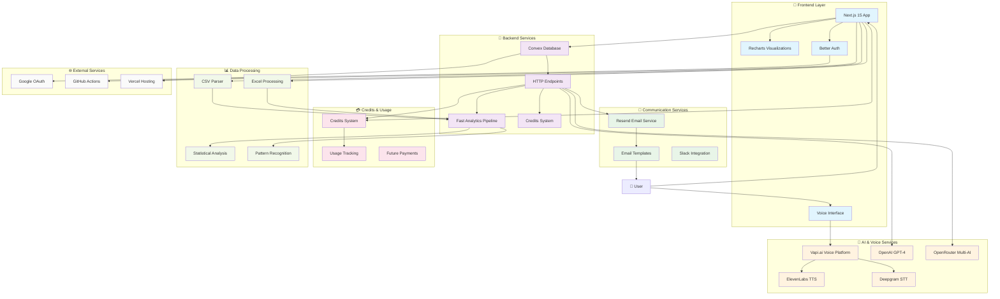

# 🎤 MutterData - Voice-Controlled Data Analytics

> **Transform data analysis through voice-powered conversations**

**MutterData** is a revolutionary voice-first data analytics platform that transforms how businesses analyze data. Instead of complex queries and manual report generation, users simply upload their CSV/Excel files and have natural conversations with their data using advanced AI and voice technology.

### 🎯 **What Makes MutterData Special:**

- **🎙️ Voice-First Analytics**: Ask questions like "What are my top performing products?" and get instant insights
- **🤖 AI-Powered Intelligence**: Advanced AI models analyze your data and provide executive-level summaries
- **📊 Instant Visualizations**: Charts and graphs appear automatically as you speak
- **📧 Smart Reporting**: Automated email reports with AI insights sent to stakeholders
- **🔄 Real-Time Processing**: Upload data and get insights in seconds, not hours
- **🎨 Beautiful Interface**: Modern, intuitive design that anyone can use

### 🏢 **Perfect For:**
- **Business Analysts** who need quick insights from spreadsheet data
- **Sales Teams** analyzing performance metrics and lead data
- **Marketing Teams** tracking campaign performance and ROI
- **Executives** who want AI-generated summaries without technical complexity
- **Small Businesses** needing enterprise-level analytics without the complexity

[](https://opensource.org/licenses/MIT)
[](https://typescriptlang.org)
[](https://nextjs.org)
[](https://convex.dev)
[](https://openai.com)
[](https://vapi.ai)
[](https://resend.com)


Built for the **Modern Stack Hackathon 2025** 🏆

## 🚀 Core Features

### 🎙️ **Voice-First Analytics**
- **Natural Speech Recognition** - Powered by Vapi.ai and Deepgram for accurate voice processing
- **Conversational Queries** - Ask questions like "What are my top performing products?" naturally
- **Multi-Language Support** - Voice commands in multiple languages (Enterprise)
- **Voice Commands** - Control the entire interface hands-free

### 🤖 **Advanced AI Intelligence**
- **Multi-Model AI** - OpenAI GPT-4, Claude, and Gemini via OpenRouter
- **Smart Summarization** - AI generates executive-level insights automatically
- **Pattern Recognition** - Advanced algorithms detect trends, correlations, and anomalies
- **Predictive Analytics** - Forecast trends and identify opportunities (Pro)

### 📊 **Intelligent Visualizations**
- **Auto-Generated Charts** - Recharts creates optimal visualizations automatically
- **Interactive Dashboards** - Real-time, responsive charts and graphs
- **Export Options** - Save charts as PNG, PDF, or PowerPoint slides
- **Custom Themes** - Beautiful, professional styling with dark/light modes

### 📧 **Smart Communication**
- **AI Email Reports** - Resend delivers comprehensive analysis reports
- **Automated Insights** - Schedule regular reports with AI-generated summaries
- **Team Collaboration** - Slack integration for team notifications (Enterprise)
- **Stakeholder Updates** - Executive-friendly reports with key findings

### 💳 **Credits & Usage System**
- **Credits-Based System** - Currently using internal credits for usage tracking
- **Transparent Usage** - Clear visibility into credit consumption per action
- **Fair Usage Limits** - Generous credit allocations for different user tiers
- **Future Payments** - Payment integration planned for production release

### 🔒 **Enterprise Security**
- **OAuth Authentication** - Secure login with Google, GitHub, and more
- **Data Encryption** - All data encrypted in transit and at rest
- **GDPR Compliant** - Privacy-first approach with data protection
- **Audit Logging** - Complete activity tracking for compliance (Enterprise)

### 🛠 **Complete Tech Stack**

#### **🎨 Frontend & UI**
- **Next.js 15** - React framework with App Router
- **TypeScript** - Type-safe development
- **Tailwind CSS** - Utility-first styling
- **Recharts** - Interactive data visualizations
- **Framer Motion** - Smooth animations
- **Radix UI** - Accessible component primitives

#### **🔧 Backend & Database**
- **Convex** - Real-time backend-as-a-service
- **Better Auth** - Modern authentication system
- **Google OAuth** - Social login integration

#### **🤖 AI & Voice Technologies**
- **OpenAI GPT-4** - Advanced AI analysis and insights
- **OpenRouter** - Multi-model AI access (GPT, Claude, Gemini)
- **Vapi.ai** - Voice AI platform for speech recognition
- **ElevenLabs** - High-quality text-to-speech
- **Deepgram** - Real-time speech-to-text

#### **📧 Communication & Notifications**
- **Resend** - Modern email delivery service
- **Email Templates** - AI-generated reports and insights
- **Slack Integration** - Team notifications (Enterprise)

#### **💳 Usage & Credits**
- **Credits System** - Internal usage tracking and management
- **Usage Analytics** - Detailed credit consumption monitoring
- **Future Payments** - Stripe integration planned for production

#### **📊 Data Processing**
- **XLSX** - Excel file processing
- **Papa Parse** - CSV parsing and validation
- **Fast Pipeline** - Advanced pattern recognition
- **Statistical Analysis** - Comprehensive data insights

#### **☁️ Infrastructure & Deployment**
- **Vercel** - Frontend deployment and hosting
- **Convex Cloud** - Backend and database hosting
- **GitHub Actions** - CI/CD automation
- **Docker** - Containerization (Enterprise)

## 🏃‍♂️ Quick Start

### 1. **Clone & Install**
```bash
git clone https://github.com/N-45div/MutterData.git
cd mutterdata
npm install
```

### 2. **Environment Setup**
```bash
cp env.example .env.local
```

Fill in your API keys in `.env.local` (see `env.example` for all available options):
```env
# 🔒 CRITICAL: Never commit .env files to version control!

# Required for AI Analytics
NEXT_PUBLIC_OPENAI_API_KEY=your_openai_api_key_here
OPENROUTER_API_KEY=your_openrouter_api_key_here

# Required for Voice Features
NEXT_PUBLIC_VAPI_API_KEY=your_vapi_api_key_here
NEXT_PUBLIC_VAPI_ASSISTANT_ID=your_vapi_assistant_id_here

# Authentication
BETTER_AUTH_SECRET=your_super_secret_auth_key_here
GOOGLE_CLIENT_ID=your_google_client_id_here
GOOGLE_CLIENT_SECRET=your_google_client_secret_here

# Convex Backend
CONVEX_DEPLOYMENT=your_convex_deployment
NEXT_PUBLIC_CONVEX_URL=your_convex_url

# Email Services
RESEND_API_KEY=your_resend_api_key_here
```

### 3. **Setup Convex**
```bash
npx convex dev
```

### 4. **Run Development Server**
```bash
npm run dev
```

Open [http://localhost:3000](http://localhost:3000) to see MutterData in action! 🎉

## 📖 How to Use

### 1. **Upload Your Data**
- Drag and drop Excel (.xlsx) or CSV files
- Or click "Load Sample Data" to try with demo data

### 2. **Start Analyzing**
- **Type queries**: "Show me top products", "What are the trends?"
- **Voice commands**: Click the mic button and speak naturally
- **Quick actions**: Use the suggested query buttons

### 3. **Get Insights**
- View real-time charts and visualizations
- Receive AI-powered insights and recommendations
- Export reports and share findings

## 🎯 Example Queries

Try these voice commands or text queries:

- 📊 **"Show me the top 5 products by sales"**
- 📈 **"What's the trend over the last 6 months?"**
- 🌍 **"Compare revenue by region"**
- 📋 **"Generate a summary of this data"**
- 🔍 **"Find correlations in the dataset"**
- 📧 **"Email this analysis to my team"**
- 🎯 **"What insights should I focus on?"**
- 📈 **"Show me anomalies in the data"**

## 🏗 System Architecture



### 🔄 **Data Flow Overview**

1. **📤 Upload**: User uploads CSV/Excel files through drag-and-drop interface
2. **🎙️ Voice Query**: User asks questions using natural voice commands via Vapi.ai
3. **🔄 Processing**: Fast Pipeline analyzes data using statistical methods and pattern recognition
4. **🤖 AI Analysis**: OpenAI/OpenRouter generates intelligent insights and summaries
5. **📊 Visualization**: Recharts creates interactive charts and graphs automatically
6. **📧 Reporting**: Resend delivers AI-generated email reports to stakeholders
7. **💳 Usage Tracking**: Credits system monitors usage and tracks consumption for future billing

## 🔧 Development

### **Available Scripts**
```bash
npm run dev          # Start development server
npm run build        # Build for production
npm run start        # Start production server
npm run lint         # Run ESLint
npx convex dev       # Start Convex development
npx convex deploy    # Deploy Convex functions
```

## 🌟 Key Innovations & Competitive Advantages

### 🎙️ **True Voice-First Analytics**
- **Advanced Voice Stack**: Vapi.ai + Deepgram + ElevenLabs for enterprise-grade voice processing
- **Natural Conversations**: Unlike text-based BI tools, users speak naturally without learning query syntax
- **Voice-Optimized UI**: Interface designed specifically for voice interactions, not retrofitted

### 🤖 **Multi-Model AI Intelligence**
- **Best-in-Class AI**: OpenAI GPT-4, Claude, and Gemini via OpenRouter for superior insights
- **Specialized Prompts**: Custom AI prompts optimized for business analytics and executive reporting
- **Context-Aware Analysis**: AI understands business context and provides relevant recommendations

### ⚡ **Lightning-Fast Processing**
- **Real-Time Pipeline**: Custom-built fast analytics engine processes data in seconds
- **Smart Caching**: Convex-powered caching system for instant repeated queries
- **Optimized Performance**: Advanced algorithms for pattern recognition and anomaly detection

### 📧 **Intelligent Communication**
- **AI-Generated Reports**: Resend + AI creates executive-level email reports automatically
- **Business-Friendly Language**: Reports written for stakeholders, not data scientists
- **Automated Distribution**: Schedule and send insights to teams without manual work

### 💡 **Modern Technology Stack**
- **Next.js 15**: Latest React framework with App Router for optimal performance
- **Convex**: Real-time backend eliminates complex state management
- **TypeScript**: Type-safe development reduces bugs and improves reliability
- **Tailwind + Radix**: Beautiful, accessible UI components with consistent design

### 🔒 **Enterprise-Ready Security**
- **Better Auth**: Modern authentication with OAuth2 and session management
- **Data Protection**: GDPR-compliant with encryption and privacy controls
- **Scalable Architecture**: Built for enterprise scale with proper security practices

## 🚀 Deployment

### **Vercel (Recommended)**
```bash
npm run build
vercel --prod
```

### **Environment Variables for Production**
Make sure to set all required environment variables in your deployment platform.


## 🏆 Hackathon Submission

**MutterData** represents the future of business intelligence - where data analysis is as simple as having a conversation. By combining voice AI, real-time processing, and intelligent visualizations, we're making data analytics accessible to everyone.
- **Voice-First**: Unlike text-based BI tools (Power BI, Tableau), MutterData is built for natural speech
- **Real-Time**: Instant processing and visualization, no waiting for reports
- **AI-Powered**: Smart insights and recommendations, not just charts
- **User-Friendly**: No training required, just speak naturally

---

**Built with ❤️ for the Modern Stack Hackathon 2024**
